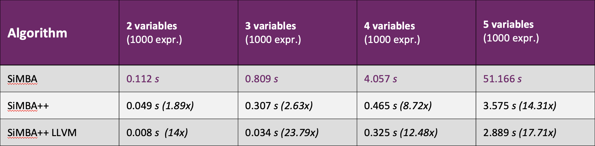

# SiMBA++

```
   _____ __  ______  ___    __    __
  / __(_)  |/  / _ )/ _ |__/ /___/ /_
 _\ \/ / /|_/ / _  / __ /_  __/_  __/
/___/_/_/  /_/____/_/ |_|/_/   /_/
°°SiMBA ported to C/C++/LLVM ~pgarba~
```

**SiMBA** (Tool for the simplification of linear mixed Boolean-arithmetic expressions (MBAs)) ported to **C/C++** with some enhancements and multithreading support. 

* **Able to directly work on LLVM IR!**
* **Compiles as standlone tool and plug-in for Clang/Opt**


Ported from:
https://github.com/DenuvoSoftwareSolutions/SiMBA

# Multithreading

MBA evaluation and verification will be run in parallel, if the MBA has more than 3 variables.

Not supported in LLVM, as LLVM does not support multithreading!

# General Options

```
  --mba=<mba>                    - MBA that will be verfied/simplified
  --mbadb=<mbadb>                - MBA database that will be verfied/simplified
  --ir=<ir>                      - LLVM Module that contains MBA functions that will be verfied/simplified
  --bitcount=<BitCount>          - Bitcount of the variables (Default 64)
  --checklinear                  - Check if MBA is a linear expresssion (Default true)
  --convert-to-llvm              - Converts the MBA database to LLVM
  --detect-simplify              - Search for MBAs in LLVM Module and try to simplify (Default false)
  --fastcheck                    - Verify MBA with random values (Default true)
  --prove                        - Prove with Z3 that the MBA is correct (Default false)
  --simplify-expected            - Simplify the expected value to match it (Default false)
  --ignore-expected              - Ignores the expected string (Default false)
  --stop=<stop>                  - Stop after N MBAs are solved (Default 0)
  --parallel                     - Evaluate/Check MBA expressions in parallel
  --optimize                     - Optimize LLVM IR before simplification (Default true)
```


# Performance

**All Tests are done on a MacBook Air M2 24GB**




# Comparison with HexRays Goomba


# SiMBA++ on real world code as Clang/Clang++ plugin


  