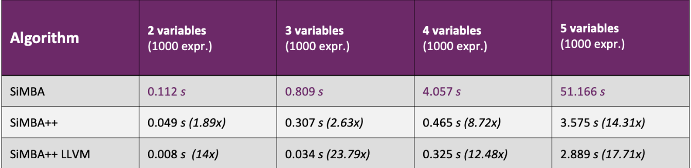
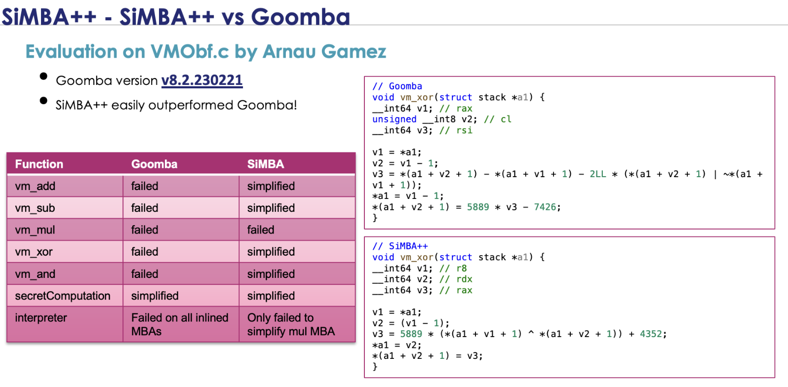
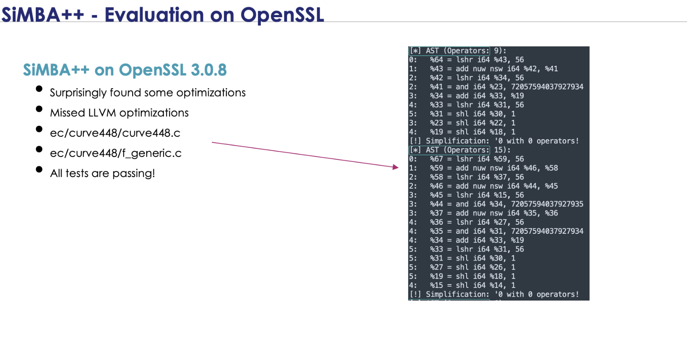

# SiMBA++

```
   _____ __  ______  ___    __    __
  / __(_)  |/  / _ )/ _ |__/ /___/ /_
 _\ \/ / /|_/ / _  / __ /_  __/_  __/
/___/_/_/  /_/____/_/ |_|/_/   /_/v2.0
°°SiMBA ported to C/C++/LLVM ~pgarba~
```

**SiMBA** (Tool for the simplification of linear mixed Boolean-arithmetic expressions (MBAs)) ported to **C/C++** with some enhancements and multithreading support. 

* **Able to directly work on LLVM IR!**
* **Compiles as standlone tool and plug-in for Clang/Opt**


Ported from:
https://github.com/DenuvoSoftwareSolutions/SiMBA

# Multithreading

MBA evaluation and verification will be run in parallel, if the MBA has more than 3 variables.

Not supported in LLVM, as LLVM does not support multithreading!

# Works with external simplifiers like SiMBA/GAMBA

Use an external simplfier like **GAMBA** to crunch non linear MBAs on LLVM IR!

# Native C++ GAMBA port (nonlinear MBAs)

The `MBA/` directory contains a native C++ port of the vendored Python **GAMBA**
simplifier (`external/GAMBA`), which extends SiMBA's linear MBA simplification to
**nonlinear** MBAs. It is built and verified independently of the main LLVM
build:

- **Build the standalone MBA core + CLI:** `powershell -File MBA\build.ps1`
  (Windows; produces `MBA\build\mba_cli.exe`) or `bash MBA/build.sh` (Linux,
  needs `llvm-config`).
- **Run the differential tests** (C++ port vs the vendored Python GAMBA oracle):
  `python MBA\run_all_tests.py 100`.
- **Solve-rate benchmark** over the GAMBA datasets:
  `python MBA/solve_rate.py 100 8`.

The port covers the parser, node core, refinement rules, expansion/factorization,
substitution, the bitwise factory, the linear simplifier, and the general
(nonlinear) simplifier. See `GAMBA_INTEGRATION_PLAN.md` for the full phase-by-phase
plan and verification status.

The `SiMBA++` CLI routes simplification through
`--simplifier {native|general|external|auto}` (default `native`; `auto` sends
linear MBAs to the native path and nonlinear ones to the native GAMBA port).
**Verification is enforced on every non-native result** ("never trust an
unverified result"):

- **Fast-check (default, `--fastcheck`):** the original expression and the
  result are compared on 100 deterministic random assignments using the GAMBA
  evaluator (modular 2^bitCount semantics, 8- and 64-bit). A counterexample
  prints the offending values and the result is reported as
  `Not valid replacement! (verification failed)` instead of a success.
- **Z3 proof (`--prove`):** the result is additionally proved equivalent to the
  original with the project's Z3 backend (`MBA/Verify.cpp` → `proveReplacement`).

The standalone `mba_cli` exposes the same checks directly:
`mba_cli verify <bitCount> <orig> <simp>` (fast-check) and
`mba_cli prove <bitCount> <orig> <simp>` (Z3; the standalone build links no
Z3, so `prove` is a no-op there — use `SiMBA++.exe --prove` for real proofs).

# GAMBA benchmark (Python oracle vs. C++ port)

For each test file of the vendored GAMBA datasets (first 100 expressions,
8-bit), both implementations simplify all expressions (fresh process per
expression) and every result is fast-checked against the dataset's
`groundtruth` column. Methodology: `MBA/BENCHMARK_PLAN.md`; reproduce with
`python MBA\bench_compare.py 100 8` (raw numbers: `MBA/bench_results.csv`).

| test file | C++ port (s) | C++ valid | Python GAMBA (s) | Python valid | speedup |
|---|---:|---:|---:|---:|---:|
| mba_obf_nonlinear | 2.1 | 100/100 | 86.4 | 100/100 | 40.7x |
| mba_flatten | 2.1 | 100/100 | 85.5 | 100/100 | 41.3x |
| syntia | 21.1 | 97/100 | 83.6 | 100/100 | 4.0x |
| mba_obf_linear | 2.1 | 100/100 | 85.6 | 100/100 | 40.8x |
| qsynth_ea | 110.8 | 77/100 | 92.0 | 100/100 | 0.8x |
| neureduce | 2.1 | 100/100 | 85.9 | 100/100 | 41.0x |
| loki_tiny | 2.0 | 100/100 | 85.3 | 100/100 | 41.8x |

"valid" = solved and fast-check equivalent to the ground truth (the ground
truth is a correct simplification of the original, so the two checks agree).
Python times include ~0.85 s of per-expression interpreter start-up (numpy
import); the C++ binary start-up is ~ms.

- `syntia`: the 3 unsolved C++ expressions are the known 97.5% solve-rate
  (they hit the 25 s deadline).
- `qsynth_ea`: the port is slower here (17/100 hit the 25 s deadline, 0.8x
  speedup) and **6 of its results are refuted by the fast-check** (77/100
  valid) — a correctness bug on those inputs: the dataset is consistent
  (original = ground truth in all 6), but the port's result is not
  (e.g. index 3, a non-constant expression, is returned as the constant
  `-1`). Open item; see `GAMBA_INTEGRATION_PLAN.md` item 6 and
  `MBA/_dbg_qsynth.py` for the per-case counterexamples.

# General Options

```
  --mba=<mba>                    - MBA that will be verified/simplified
  --mbadb=<mbadb>                - MBA database that will be verified/simplified
  --ir=<ir>                      - LLVM Module that contains MBA functions that will be verified/simplified
  --bitcount=<BitCount>          - Bitcount of the variables (Default: 64)
  --checklinear                  - Check if MBA is a linear expresssion (Default: true)
  --convert-to-llvm              - Converts the MBA database to LLVM
  --detect-simplify              - Search for MBAs in LLVM Module and try to simplify (Default: false)
  --fastcheck                    - Verify MBA with random values (Default: true)
  --prove                        - Prove with Z3 that the MBA is correct (Default: false)
  --simplify-expected            - Simplify the expected value to match it (Default: false)
  --ignore-expected              - Ignores the expected string (Default: false)
  --stop=<stop>                  - Stop after N MBAs are solved (Default: 0)
  --parallel                     - Evaluate/Check MBA expressions in parallel
  --optimize                     - Optimize LLVM IR before simplification (Default: true)
  --external-simplifier          - Use SiMBA/GAMBA or m as simplifier instead of internal (Path to simplify.py/simplify_general.py)
  --simplifier                 - MBA simplifier to use: native | general | external | auto (Default: native)
  --max-var-count                - Max variable count for simplification (Default: 6)
  --min-ast-size                 - Minimum AST size for simplification (Default: 4)
  --walk-sub-ast                 - Walk sub AST if full AST does not match (Default: false)
  --print-smt                    - Print SMT2 formula for debugging purposes
  --timeout                      - Timeout in seconds for the Z3 solver / simplifiers (Default: 30)
  --accept-unknown               - Accept unknown as unsat (Accept long timeout as prove!) (Default: false)

```


# Performance

**All Tests are done on a MacBook Air M2 24GB**



# Comparison with HexRays Goomba




# SiMBA++ on real world code as Clang/Clang++ plugin


